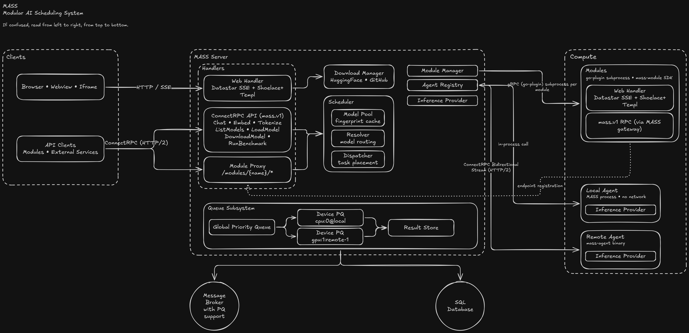

# MASS - Modular AI Scheduling Service

AI inference and workload scheduling service. Runs LLM inference on [llama.cpp](https://github.com/ggerganov/llama.cpp) via [llama-go](https://github.com/tcpipuk/llama-go) and dynamically schedules AI workloads across available compute resources. Exposes chat completion and embedding endpoints over [Twirp](https://github.com/twitchtv/twirp) RPC with Prometheus metrics, API key auth, and automatic GPU detection.

*AI powered applications made easy.*

## Features

- Chat completion and batch chat completion (GGUF models)
- Text embeddings and batch embeddings
- Automatic GPU offloading when CUDA is available
- Worker pool with persistent llama.cpp contexts per model
- Reasoning model support (e.g. DeepSeek-R1 thinking token extraction)
- Prometheus metrics (`/metrics` on port 2112)
- Bearer token authentication

## Backends

MASS ships one binary per platform/backend combination — pick the one matching your hardware. Each binary statically links the relevant ggml backend (CUDA, ROCm, Metal, or CPU-only) to keep download size small (NVIDIA cuBLAS DLL alone is ~285 MB).

| Platform        | CPU-only | NVIDIA (CUDA) | AMD (ROCm) | Apple (Metal) |
|-----------------|----------|---------------|------------|---------------|
| Linux x86_64    | ✅       | ✅            | ✅         | —             |
| Linux arm64     | ✅       | ✅ (Jetson)   | —          | —             |
| Windows x86_64  | ⚠️       | ✅            | —          | —             |
| macOS arm64     | —        | —             | —          | ✅            |

⚠️ Windows CPU-only is not currently produced by `make-win.ps1` (Windows users typically want CUDA). Use Linux for CPU-only deployments.

## Prerequisites

| Tool | Linux | Windows (native) | macOS |
|------|-------|-------------------|-------|
| Go 1.26+ | [go.dev](https://go.dev/dl/) or goenv | [go.dev](https://go.dev/dl/) | `brew install go` |
| GCC/G++ | `apt install build-essential` | MSYS2 MinGW-w64: `pacman -S mingw-w64-x86_64-gcc` | Xcode CLT (`xcode-select --install`) |
| CMake | `apt install cmake` | Bundled with VS or [cmake.org](https://cmake.org/download/) | `brew install cmake` |
| CUDA Toolkit *(NVIDIA)* | `apt install cuda-toolkit` | [nvidia.com](https://developer.nvidia.com/cuda-downloads) | — |
| ROCm Toolkit *(AMD)* | [rocm.docs.amd.com](https://rocm.docs.amd.com) | — | — |
| Visual Studio *(NVIDIA only)* | - | 2022 Community, "Desktop C++" workload | — |
| Ninja | - | `pacman -S mingw-w64-x86_64-ninja` | `brew install ninja` |

## Quick start

```bash
# Clone
git clone https://github.com/chinese-room-solutions/mass.git
cd mass

# Pick the build matching your hardware (output: bin/mass):
make build-cpu      # CPU-only
make build-cuda     # NVIDIA / CUDA
make build-rocm     # AMD / ROCm        (Linux only)
make build-metal    # Apple Silicon     (macOS only)

# Run
make run CONFIG=config/advert.yml
```

## Build commands

All commands go through the `Makefile`. On Windows, the Makefile delegates build steps to `make-win.ps1` automatically (currently CUDA-only).

| Command | Description |
|---------|-------------|
| `make build-cpu` | CPU-only binary |
| `make build-cuda` | NVIDIA CUDA binary |
| `make build-rocm` | AMD ROCm binary (Linux only) |
| `make build-metal` | Apple Metal binary (macOS only) |
| `make build BUILD_TAGS=<backend>` | Generic form (`backend` ∈ empty, `cublas`, `hipblas`, `metal`) |
| `make build-libs` | Build llama-go static libraries only |
| `make run [CONFIG=...]` | Build and run (default: `config/dev.yml`) |
| `make docker-build [TAG=...]` | Build Docker image |
| `make proto` | Regenerate protobuf/ConnectRPC code |
| `make test` | Run full test suite with race detector |
| `make lint` | Run golangci-lint |
| `make fmt` | Format Go code |
| `make tidy` | Tidy go.mod |
| `make clean` | Remove `bin/` |
| `make clean-all` | Remove `bin/` and llama-go build artifacts |

### Windows notes

On Windows the Makefile invokes `make-win.ps1` for native build steps (CUDA DLLs, MinGW libs). You can also call it directly for Windows-specific options:

```powershell
.\make-win.ps1 build -CudaArch 86    # Target RTX 30xx only (default: 61;75;86;89;90;120)
.\make-win.ps1 help                   # Show all options
```

See [WINDOWS_GPU_BUILD.md](WINDOWS_GPU_BUILD.md) for architecture details and troubleshooting.

## Configuration

MASS uses a single YAML config file stored in the user config directory (e.g. `%APPDATA%/mass/config.yml` on Windows). Defaults are embedded in the binary and written on first run. Module settings are stored in a sibling `modules.yml` file.

```yaml
listen_addr: ":3455"
auth_token: ""
data_dir: ""
theme: dark
dev_mode: false
logger:
  level: debug
  console_writer: true
tls:
  enabled: false
  cert_file: ""
```

All settings are also editable through the web UI Settings tab.

### TLS / SSL

MASS supports TLS for encrypted worker and API communication. By default, MASS uses plaintext HTTP/2 (h2c), suitable for localhost and trusted networks.

To enable TLS, provide a PEM file containing both the certificate and private key:
```yaml
tls:
  enabled: true
  cert_file: /path/to/server.pem
```

**Worker connection with TLS:**
```bash
# Self-signed cert: worker must trust the CA
mass-worker --mass-url https://mass-host:3455 --ca-file /path/to/ca.pem --token mytoken

# Trusted CA (e.g. Let's Encrypt): no --ca-file needed
mass-worker --mass-url https://mass-host:3455 --token mytoken
```

## Environment variables

| Variable | Default | Description |
|----------|---------|-------------|
| `MASS_AUTH_TOKEN` | _(empty)_ | Override config file auth token |
| `LLAMA_LOG` | `error` | llama.cpp log verbosity: error, warn, info, debug |
| `LLAMA_GO_DIR` | `../llama-go` | Path to llama-go (for builds) |
| `BUILD_TAGS` | _(empty)_ | Set to `cublas` for GPU builds |
| `CUDA_ARCH` | auto-detect | CUDA compute capability (GPU builds only) |

## API

MASS exposes two categories of HTTP endpoints:

### Inference API (ConnectRPC)

Inference endpoints live under `/mass.Mass/` and accept JSON or protobuf. Defined in [service.proto](rpc/service.proto):

| Method | Description |
|--------|-------------|
| `POST /mass.Mass/ChatCompletion` | Chat completion (supports `"stream": true` for SSE) |
| `POST /mass.Mass/BatchChatCompletion` | Batch chat completions |
| `POST /mass.Mass/Embedding` | Text embedding |
| `POST /mass.Mass/BatchEmbedding` | Batch text embeddings |
| `POST /mass.Mass/Tokenize` | Tokenize text |

### Public REST API (`/api/v1/`)

Versioned JSON endpoints for programmatic access by modules, external tools, and the web UI:

| Endpoint | Description |
|----------|-------------|
| `GET /api/v1/models` | List available models. Filters: `?type=chat\|embedding`, `?search=...` |
| `GET /api/v1/models?id={publisher/repo/variant}` | Get detailed model specs (GGUF metadata, capabilities) |
| `GET /api/v1/models?status=true` | Include runtime status (loaded, active requests, mode) |
| `POST /api/v1/models/load` | Load a model into the scheduler pool |
| `POST /api/v1/models/import` | Import a local GGUF file into the models directory |
| `GET /api/v1/browse/roots` | List filesystem roots (for file picker) |
| `GET /api/v1/browse?dir=...&ext=...` | Browse directory contents |
| `GET /api/v1/sync-logs` | Fetch current log buffer |
| `GET /ping` | Health check |

### Internal UI endpoints (`/api/`)

Unversioned endpoints that return SSE/Datastar patches (HTML fragments + signal updates) for the web UI. These are consumed by the browser via Datastar's `@get`/`@post` directives and are not intended for external use. They cover module lifecycle, settings, model management UI, HuggingFace search/download, and scheduler visualization.

## Module system

MASS is built around a plugin architecture. Each module is a standalone process — a compiled binary, a Python script, a Node.js app, or anything else that can be launched via a command. Modules communicate with MASS over gRPC using the [go-plugin](https://github.com/hashicorp/go-plugin) protocol. They can declare model requirements, expose custom web UI, and handle API requests — all while MASS manages the underlying inference engine and scheduler.

### Runtime abstraction

The scheduler is decoupled from module execution via a `ModuleRuntimeInterface`. Today all modules run as bare processes (`Manager` implementation). The interface enables future runtime backends without changes to scheduling logic:

| Runtime | Status | Use case |
|---------|--------|----------|
| Process (`Manager`) | Current | Local development, single-machine deployment |
| Docker | Planned | Isolated execution, shared machines |
| Kubernetes | Planned | Enterprise, multi-node GPU clusters |

All communication happens over gRPC regardless of runtime — module code is the same whether it runs as a local process, a Docker container, or a K8s pod.

### Inference runtime abstraction

Model loading is abstracted behind a `ModelLoaderInterface`, decoupling the scheduler from any specific inference runtime. Today MASS uses [llama.cpp](https://github.com/ggerganov/llama.cpp) via llama-go for GGUF models. The interface allows adding new runtimes without changing scheduling or module code:

| Runtime | Status | Formats |
|---------|--------|---------|
| llama.cpp (`pkg/llama`) | Current | GGUF (chat + embedding) |
| ONNX Runtime | Planned | ONNX models |
| vLLM | Planned | HuggingFace models, tensor-parallel GPU inference |

Modules declare model requirements by type (chat or embedding) — the scheduler picks the right runtime based on the model format.

### How it works



**Lifecycle:** Package (.mass) → Install → Discover (spawn process, call `GetInfo`) → Start (load models) → Serve UI + API

### Module SDK

Modules implement the `Module` interface from [mass-module](https://github.com/chinese-room-solutions/mass-module):

| Method | Purpose |
|--------|---------|
| `GetInfo()` | Return name, version, model requirements, UI capability |
| `HTTPHandler()` | Return an `http.Handler` serving the module's web UI (full pages, not fragments) |
| `HandleRequest(method, payload)` | Handle API calls routed by proto service descriptor |
| `Health()` | Health check |

Module UIs are served as full HTML pages via `HTTPHandler()`. MASS proxies `/modules/{name}/*` to the module over gRPC (`HandleHTTP`/`HandleHTTPStream`), rendering them inside an iframe in the MASS shell. The SDK provides `uikit.Layout()` to wrap content with shared theme CSS and CDN dependencies.

### Package format

Modules are distributed as `.mass` files (ZIP archives) containing the binary, a `module.yml` metadata file, and optionally a `config.yml` with default settings (auto-detected during install).

```yaml
# module.yml
name: playground
version: 0.1.0
description: Interactive API playground for testing MASS inference endpoints
sdk_version: "1"
command: ${MODULE_DIR}/mass-playground.exe --headless
ui_path: "/"
icon: icon.png
dependencies:
  - name: embedding
    version: ">=0.1.0"
    source: "github:chinese-room-solutions/mass-embedding"
  - name: vision
    version: "^1.0.0"
    source: "github:chinese-room-solutions/mass-vision"
```

MASS resolves the full dependency graph (including transitive dependencies), checks installed versions first, and only downloads from the source when no installed version satisfies the constraint. Multiple versions of the same module can coexist on disk (`modules/{name}/{version}/`). Resolved versions are recorded in a `module.lock` file for reproducible installs.

Supported version constraints follow [semver](https://semver.org/) conventions: `^1.2.0` (compatible), `~1.2.0` (patch-level), `>=1.0.0`, `<2.0.0`, and combinations.

Supported sources:
| Source | Example | Description |
|--------|---------|-------------|
| GitHub Releases | `github:owner/repo` | Downloads `.mass` assets from GitHub Releases (public or private with token) |

### Path macros

Module commands and config paths support variable expansion, resolved at load time:

| Macro | Resolves to | Example |
|-------|-------------|---------|
| `${MODULE_DIR}` | Module's install directory | `D:\data\modules\embedding\0.1.0` |
| `${MODULES_DIR}` | All modules directory | `D:\data\modules` |
| `${DATA_DIR}` | MASS data directory | `D:\data` |

This keeps `modules.yml` portable — paths adjust automatically if the data directory changes.

### UI integration

Module UIs are full HTML pages served via `HTTPHandler()` and displayed in an iframe within the MASS shell. MASS proxies HTTP requests over gRPC, including SSE streaming (`HandleHTTPStream`). The SDK provides `uikit.Layout()` for shared theme CSS, [Datastar](https://data-star.dev/) SSE, [Shoelace](https://shoelace.style/) web components, and Tailwind CSS — all via CDN. Modules can also run standalone with a native webview window via the SDK's `webview.Open()` package.

### Debug mode

Set `debug: true` in a module's config to attach to an already-running module process (e.g. under a debugger). MASS reads a `.reattach.json` file from the module directory to connect via TCP instead of spawning a subprocess.

## Docker

```bash
make docker-build
docker compose up -d
```
